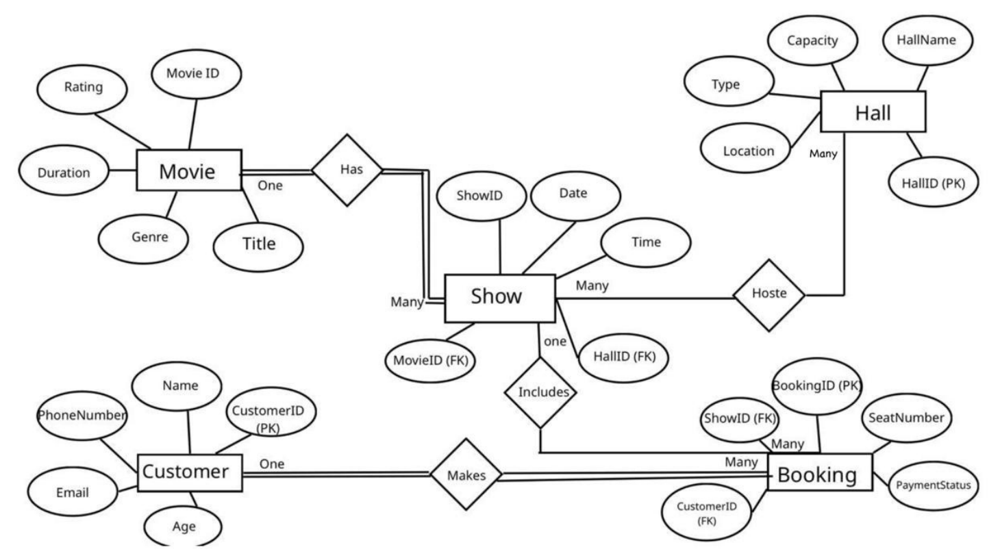
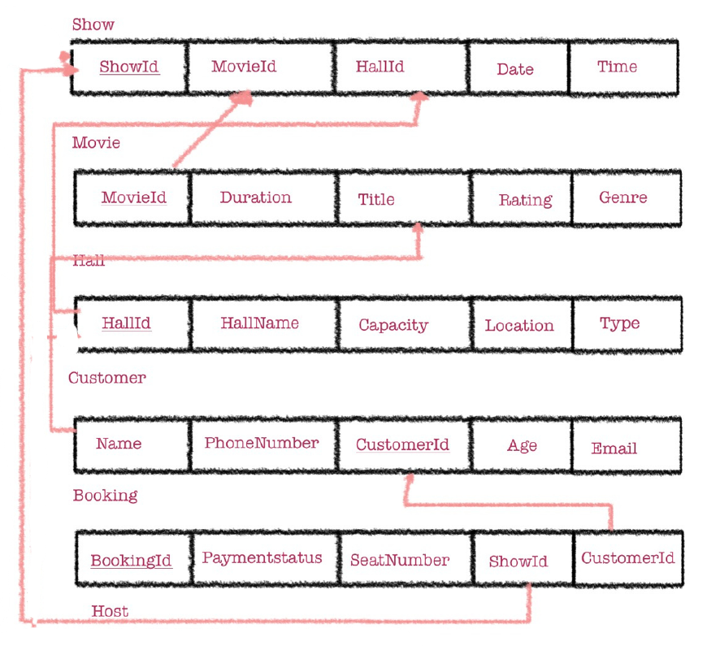

# Cinema Booking System

A relational database for managing a cinema's movies, halls, shows, customers and seat bookings. Designed from scratch: scenario, entities and relationships, ER diagram, relational schema, and a full SQL implementation with sample data and queries.

Team project for a Database course (5 students).

## Scenario

| Entity | Attributes |
|---|---|
| **Movie** | MovieID (PK), Title, Genre, Duration, Rating |
| **Hall** | HallID (PK), HallName, Capacity, Type, Location |
| **Show** | ShowID (PK), Date, Time, MovieID (FK), HallID (FK) |
| **Customer** | CustomerID (PK), Name, PhoneNumber, Email, Age |
| **Booking** | BookingID (PK), SeatNumber, PaymentStatus, ShowID (FK), CustomerID (FK) |

## Relationships

- One Movie can have many Shows.
- One Hall can host many Shows.
- One Show can have many Bookings.
- One Customer can make many Bookings.
- Each Booking belongs to one Customer and one Show.

## ER diagram



## Relational schema



## SQL implementation

[`schema.sql`](schema.sql) (MySQL) covers:

- **DDL:** `CREATE DATABASE`, `CREATE TABLE` with primary and foreign keys, `ALTER TABLE ... ADD`
- **DML:** `INSERT` (10 rows per table), `UPDATE`, `DELETE`
- **Queries:** multi-table `JOIN`s (4 tables), `GROUP BY` with `COUNT`, `ORDER BY`, filtering with `WHERE`

Example, which customer booked which movie, on what date, in which seat:

```sql
SELECT Customer.Name, Movie.Title, Shows.Date, Booking.SeatNumber
FROM Booking
JOIN Customer ON Booking.CustomerID = Customer.CustomerID
JOIN Shows    ON Booking.ShowID     = Shows.ShowID
JOIN Movie    ON Shows.MovieID      = Movie.MovieID;
```

Note: the **Show** entity from the ER diagram is implemented as the table `Shows`.

### Run it

```bash
mysql -u root -p < schema.sql
```

Or open `schema.sql` in MySQL Workbench and run it.

## Team and contributions

| Member | Contribution |
|---|---|
| Alraha Abdullah | Scenario, entities and attributes, relationships, ER diagram |
| Halimah Ahmed Alsfsafi | Scenario, entities and attributes, relationships, ER diagram |
| Bayan Obaid Alrashdi | Schema diagram |
| Shatha Abdullah Almarhabi | Creating tables |
| Laila Omar Alshulii | SQL manipulation commands and complex querying |

## Files

```
├── schema.sql                                  # full SQL script
├── docs/
│   ├── er-diagram.png
│   ├── schema.png
│   └── Cinema-Booking-System-Presentation.pdf  # final presentation (22 slides)
└── README.md
```

## Skills demonstrated

Database design, ER modeling, relational schema design, SQL (DDL, DML, joins, aggregation), MySQL, teamwork.
