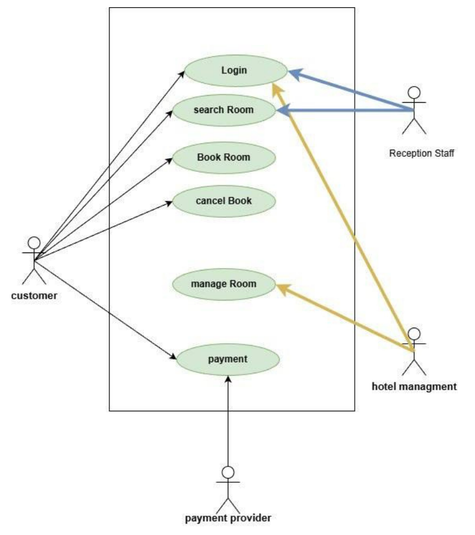
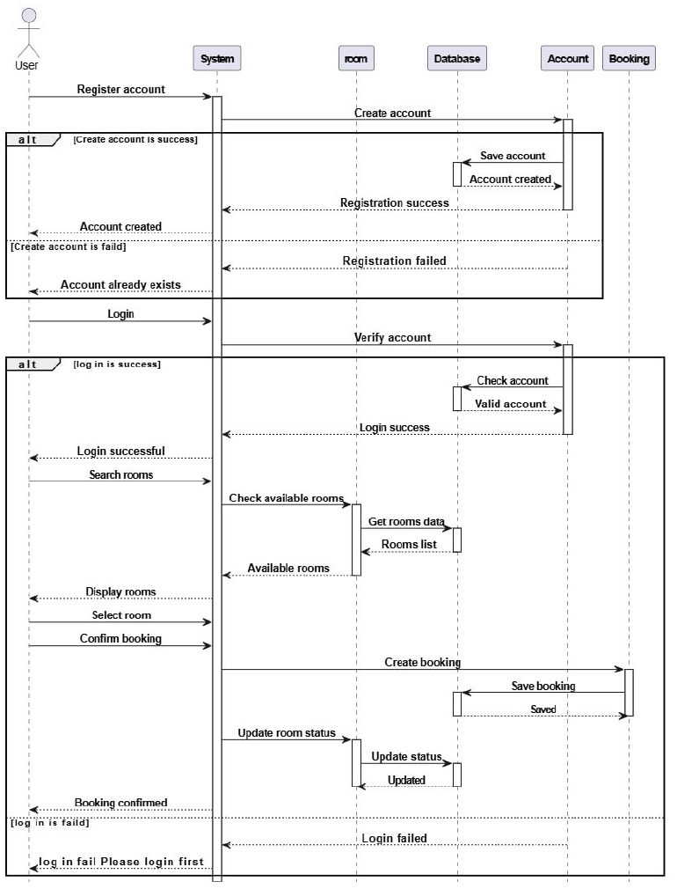
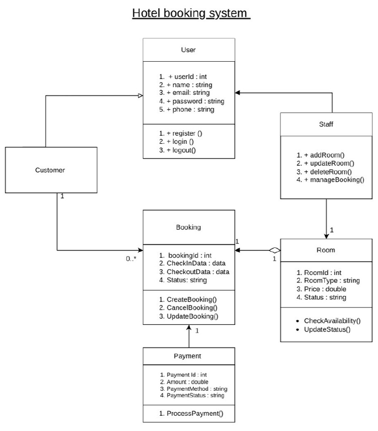
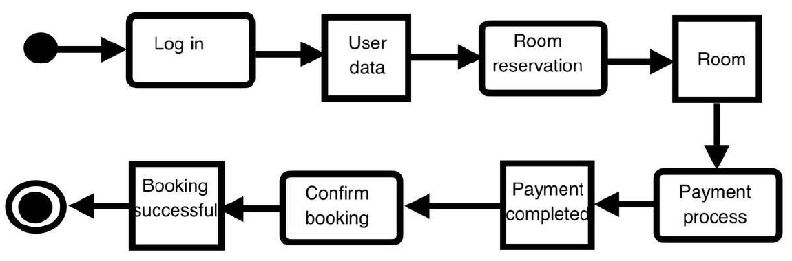
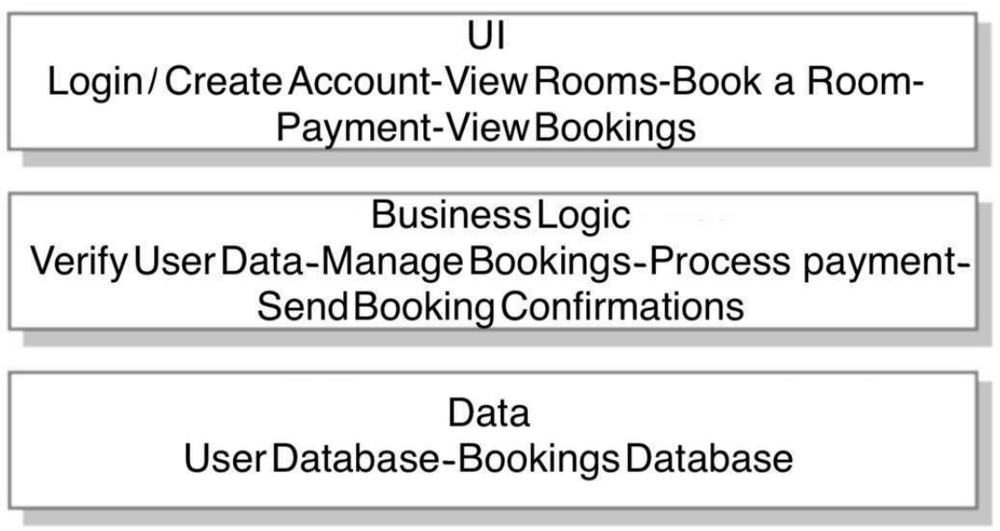

# Hotel Booking System

Software design project for a hotel booking application. Customers register, search for available rooms and book them online; hotel staff manage rooms and reservations.

This repository contains the analysis and design work (requirements, UML diagrams, architecture). Team project for a Software Engineering course (4 students).

## Problem and solution

Many hotels manage room reservations and customer information manually. Customers need an easy way to book before arriving, and hotels need a system to manage bookings efficiently.

The system lets customers search for available rooms, make reservations and manage their bookings online, and helps staff track reservations, check-in/check-out and customer details.

## Process

- **SDLC model:** Waterfall (requirements analysis, system design, implementation, testing, maintenance)
- **Planning:** Gantt chart for the project timeline and task division

## Actors

| Actor | Role |
|---|---|
| Customer | Searches for and books rooms |
| Hotel staff | Manages reservations |
| System administrator | Manages and maintains the system |

## Requirements

**Functional**

1. Customers can book rooms online.
2. Staff can add, update or delete room information.
3. The system updates room status automatically.
4. The system supports different payment methods.
5. Customers can create accounts and log in.
6. Customers can view, modify or cancel bookings.
7. Customers can search for available rooms.
8. The system sends booking confirmation.

**Non-functional**

1. The system protects user data securely.
2. The system responds quickly to user requests.
3. The system stores data in encrypted form.
4. The system provides a simple and user-friendly interface.
5. The booking process is clear and easy to use.

## Design

### Use case diagram


### Sequence diagram
Registration, login, room search, booking and room status update, with success and failure paths.



### Class diagram


### Activity diagram


### Architecture
Three layers: UI, business logic, data.



## Files

```
├── docs/
│   ├── use-case-diagram.png
│   ├── sequence-diagram.png
│   ├── class-diagram.png
│   ├── activity-diagram.png
│   ├── architecture.png
│   └── Hotel-Booking-System-Presentation.pdf   # full presentation (15 slides)
└── README.md
```

## Team

Alraha Abdullah, Amal Awad Al Zubaidi, Bayan Obaid Al Rashidi, Talah Ateeq Al Zahrani

## Skills demonstrated

Requirements analysis, UML modeling (use case, sequence, class, activity), layered architecture, Waterfall SDLC, project planning, teamwork.
